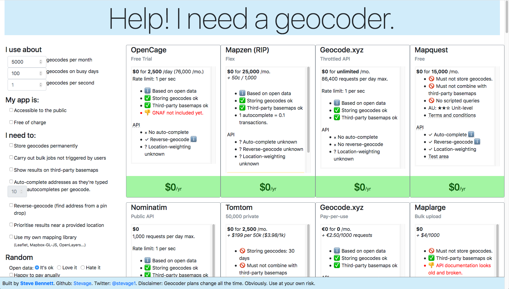

## Which Geocoder

This simple website helps users find the geocoding service (API) that meets their needs. It was built as part of a research process to identify the right service for one particular software vendor, in March 2018. For that reason, it currently has a bias towards Australian coverage.

https://stevage.github.io/which-geocoder

The data will go out of date quickly, so: **contributors are very much wanted** to help keep it fresh. Just submit a pull request for changes to plans.js.

### Scope

The site aims to include publicly-hosted geocoding APIs. 

Excluded for now:

* Geoocoding software that must be downloaded and installed (such as [Photon](https://github.com/komoot/photon), [Pelias](https://github.com/pelias/pelias) and [Data61's gnaf geocoder](https://github.com/data61/gnaf).)
* User-facing websites that allow upload of spreadsheets, but don't have APIs, such as [JoinAddress](https://geocoder.wigeogis.com/welcome).

